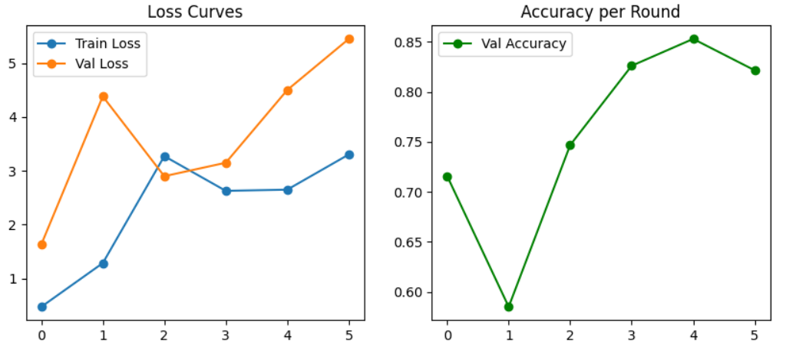
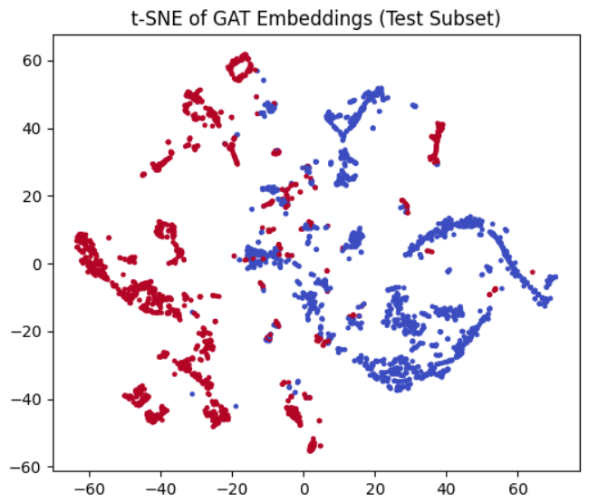

# Simulated Federated Learning on NSL-KDD using GAT

Graph Attention Networks trained in a federated setting for intrusion detection on NSL-KDD. Includes privacy-loss vs rounds, loss/accuracy curves, and a t‑SNE view of GAT embeddings.

---

## Metrics

- **Accuracy:** 0.8795  
- **Precision:** 0.8898  
- **Recall:** 0.8552  
- **F1:** 0.8722  
- **AUC:** 0.9139  

---

## What this does

We simulate **Federated Learning (FL)** across multiple clients that each hold a shard of NSL‑KDD. A server aggregates client model updates after every communication round (e.g., FedAvg). The model is a **Graph Attention Network (GAT)** built over a graph of samples (e.g., k‑NN graph in feature space). Attention lets the model weigh neighbors when passing messages, which helps capture non-linear relations between similar traffic records.

**Privacy loss vs rounds:** when using differential privacy (DP), the privacy budget (ε) *accumulates* as rounds increase. More rounds → more exposures of (noised) updates → higher overall ε, meaning weaker privacy guarantees. The plot below illustrates this monotonic increase with training rounds.

---

## Plots

  <figure style="flex: 1; min-width: 300px; max-width: 400px; text-align:center;">
    
    <figcaption>Training dynamics: loss decreases while accuracy improves over time.</figcaption>
  </figure>
  <figure style="flex: 1; min-width: 300px; max-width: 400px; text-align:center;">
    
    <figcaption>t‑SNE projection of final‑round GAT embeddings; clusters reflect attack vs normal and sub‑types.</figcaption>
  </figure>

*Figure note:* Privacy loss (ε) increases with the number of federated rounds (DP composition).

---

## Overall Metrics

| Model          | Accuracy | Precision | Recall | F1    | AUC   |
|----------------|:--------:|:---------:|:------:|:-----:|:-----:|
| Federated GAT  | 0.8795   | 0.8898    | 0.8552 | 0.8722| 0.9139|

> Numbers are overall (macro/weighted as configured in code), reported on the held‑out test split.
